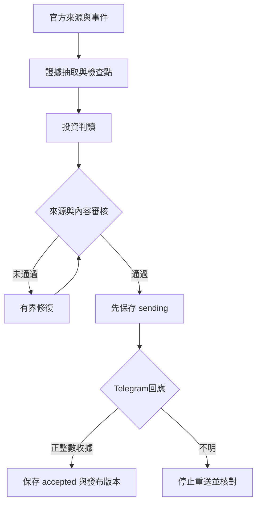

# 自動推播架構與驗證

更新：2026-10-05 JST。

## 投資人輸出

- 單層條列；正文目標900–1500字、上限1800字，再附官方來源。不為填滿篇幅補造判斷。
- 投資結論：本季真正改變什麼、投資意義與證據限制。
- 關鍵數據與財測：期間、原始單位、GAAP/non-GAAP/Adjusted分類、完整指引及重要比較；每組數據交代有證據的含義。
- 營運與Q&A：最重要需求、客戶、供给或法說議題；沒有取得就揭露缺口。
- 風險與待驗證：主要反證、弱點及下一個觀察指標。
- 分開客觀事實、管理層說法及分析推論；没有外部共識不判定Beat/Miss，不加入目標價或買賣指令。

## 工作流程

## 已修復的共同問題

| 原問題 | 現在行為 |
|---|---|
| 過長報告靜默刪尾，可能遺失風險或來源 | 完整正文與來源以UTF-16保守限長；超長先修訂，不能截尾後發布 |
| 指定公司只限制蒐集，未限制既存事件 | 實際待分析事件也套用公司範圍 |
| 模型高分或pass與問題陣列不一致 | 程式規則及非空關鍵錯誤陣列仍阻擋發布 |
| 分析失敗卻返回成功 | 非零結果揭露失敗，失敗後仍保存完成狀態 |
| 中斷時重做全部分析 | 來源／階段檢查點復用，僅重跑失敗或政策變更的階段 |
| 發送中斷後可能重複 | 發送前保存sending，取得正整數message_id才accepted；不明結果不盲目重送 |
| bool被當成int訊息編號 | 嚴格要求type(message_id) is int且大於0 |
| 本地保存中斷損壞JSON | 暫存檔原子替換；GitHub Actions在監控失敗後也嘗試保存狀態 |
| 已披露純數字成長率／全形％被誤擋 | 正規化全形符號，reported_change須與支持引文吻合；未披露計算仍阻擋 |
| 否定語句被當成強結論 | 局部辨識不能判定／尚待驗證；其他肯定強結論仍須直接證據 |

## 執行與維護界線

GitHub Actions在雲端執行，不依賴電腦或手機開啟。排程可能延遲；來源、模型供應商可能暫時不可用。CI成功、程序完成、Telegram接受訊息是不同證據；跳過週末或等待文件不能算推播成功。

Telegram收據只證明API接受，不代表使用者已讀。原子檔案保存不等同交易式資料庫或完整災難復原；sending/unknown需核對收據。缺逐字稿、外部共識或必要證據時應揭露或阻擋，不補造內容。

已安排2026-10-05 01:07–08:07 JST共8次每小時PDCA檢查。檢查新正式結果，有問題才修復、測試、重跑；已成功歷史驗證不重送。維護任務受ChatGPT平台及用量限制，不能保證無限續跑。

用量最後觀察五小時剩18%、每週剩85%；尚未消耗重置券。最早免費券於2026-10-05 07:49 JST到期，僅在實際耗盡且仍可操作、仍可用時依授權使用。不購買credits、不啟用自動加值。平台若在耗盡時阻止操作，不能宣稱已重置。

## 美股專屬修復與驗證

SEC EDGAR優先，官方IR及逐字稿補充；生產V5使用來源單元覆蓋清單、稀疏證據卡與研究資料包。

- V5原先直接繼承供應商客戶端而漏套報告契約，已在分析、審核、修訂套用程式品質檢查。
- 保留metric_type與reconciliation，Adjusted指標缺調節就阻擋。明確單邊指引只有原文明示至少／至多且類型一致才可接受。
- 表格引文保留註腳和中間欄位；只修有問題證據卡，核對同一官方文件全文與跨段調節，保留已驗證資料。
- 修訂收到具體*_errors及最新審核稿，不只收到分類標籤。
- Gemini 3使用預設採樣及明確低思考，降低有界JSON截斷；不放寬財務證據門檻。
- 修復既有Reuters www網域去重測試。

118個本機與分支CI測試通過。六輪真實SEC/Gemini/Telegram歷史驗證後，run37213598499成功，Telegram message_id **514**、report_version **1**。前面遭阻擋的回放沒有推播。測試使用隔離狀態，訊息標示「歷史資料驗證｜非即時行情」。

- [已合併PR20](https://github.com/wowheisjason/us-earnings-monitor/pull/20)
- [成功實測與完整payload/收據產物](https://github.com/wowheisjason/us-earnings-monitor/actions/runs/37213598499)
- 核心部署提交：28c288a9bca5d2c8dcd53ad69dc036bc39bddab7。

後續文字改善：獨立daily news改為新事實與重點摘要兩個條列，保留來源日期及既有字數上限；財報契約禁止在投資人輸出提及Research Packet等內部術語。此文字修改不重送上述已成功歷史回放。
